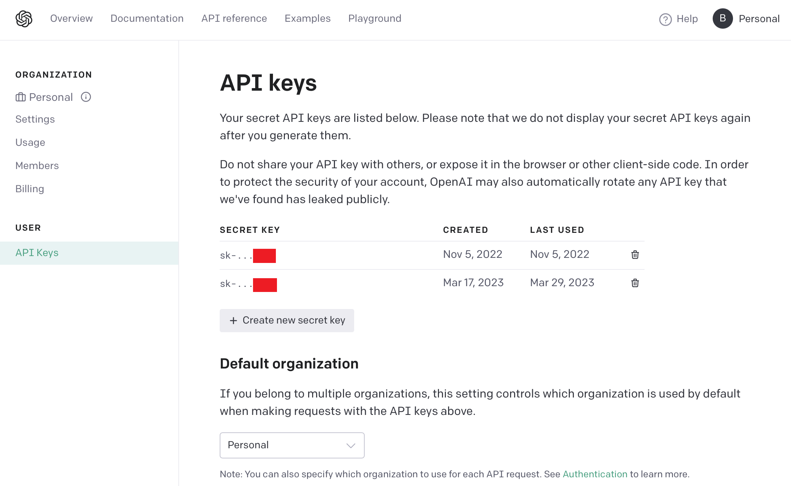

# ChatARKit: Using ChatGPT to Create AR Experiences with Natural Language
*Copyright 2022-2023 Bart Trzynadlowski*

## Demo Video

[Click here for a demo video](https://youtu.be/bJFa5HOmhl4).


## Overview

ChatARKit is an experiment to see whether [ChatGPT](https://chat.openai.com/chat) can be harnessed to write code using custom user-defined APIs. You can speak a prompt asking ChatARKit to place objects of a certain type on nearby planes and perform some basic manipulations of their position, scale, and orientation. More interactions could readily be added. Here are some sample prompts to try:

- "Place a cube on the nearest plane and make it spin."
- "Place a spinning cube on the floor."
- "Place a car on the table and make it drive back and forth along the surface."
- "Place a school bus on the nearest plane and then rotate it by 90 degrees."

Full disclosure: the demo video represents some of the best results I got. Performance is generally worse.  ChatGPT produces highly variable results for identical prompts. It frequently injects JavaScript functions that are not present in my JavaScriptCore execution context and will misinterpret the relationship between the user, `cameraPosition`, and planes. Sometimes it converts object descriptions into code-like identifiers (e.g., "school bus" becomes "schoolBus"), which breaks the Sketchfab querying logic. Much of this is fixable and it's a good idea to examine the generated code, which is printed to the console by the iOS app.

I encourage interested developers to contact me and discuss ways this could be improved and turned into a more robust demo. And if you have any other fun ideas for AI projects, I'm always up to chat :)

ChatARKit makes use of the following projects:

- [whisper.cpp](https://github.com/ggerganov/whisper.cpp) by Georgi Gerganov. Fast C++ implementation of OpenAI's Whisper speech-to-text model.
- [GLTFSceneKit](https://github.com/magicien/GLTFSceneKit) by magicien. gLTF loader for SceneKit, used to import 3D assets from [Sketchfab](https://sketchfab.com).
- [Zip](https://github.com/marmelroy/Zip) by Roy Marmelstein. Swift framework for unzipping files, used to unzip files downloaded from Sketchfab.
- [pyChatGPT](https://github.com/terry3041/pyChatGPT) by terry3041. A Python wrapper for accessing ChatGPT. My Python ChatGPT server app depends on this.

## Usage Instructions

### 1. Download the Whisper Model Weights

Before opening the iOS project, make sure to download the required Whisper model. From the root of the repository directory on MacOS, type:

```
curl -L --output iOS/ChatARKit/ChatARKit/ggml-base.en.bin https://huggingface.co/datasets/ggerganov/whisper.cpp/resolve/main/ggml-base.en.bin
```

### 2. Obtain an OpenAI API Key

The initial release of ChatARKit used a Python bridge to interact with the ChatGPT web site using Chromium. Now, the entire app is self-contained and uses the OpenAI directly. This is much simpler and faster but requires a paid account. Obtaining a new API key is straightforward from the account management page, shown below. Open `iOS/ChatARKit/ChatARKit/APIKeys.swift` and paste the key into the `openAI` string.



If you are nervous about how much this will cost, I have racked up a $0.08 bill after 52 queries. Set aggressive hard limits to be safe (mine is $32.00).

### 3. Obtain a Sketchfab API Token

[Sketchfab](https://sketchfab.com) is used to fetch 3D assets (except "cube" which is handled natively). Sign up for a free user account and then under your profile settings, find your API token. Open up `iOS/ChatARKit/ChatARKit/APIKeys.swift` and paste the key into the `sketchfab` string.

The profile settings can be found by clicking on your user icon in the upper right. Then, click *Edit Profile*.


The API token is under *Passwords & API*.


 
### 4. Launch ChatARKit on iPhone and Try a Prompt!

Open `iOS/ChatARKit/ChatARKit.xcodeproj` and deploy ChatARKit to your iPhone. 

Look around to ensure some planes are detected and then press the *Record* button and speak a prompt. For example: "Place a cube on the nearest plane." Press *Stop* when finished to parse the result. Receiving code from ChatGPT and then executing it can take a while. Be patient. Downloading Sketchfab models is usually the most time-consuming part of the process and it often fails. Currently, no status or error messages are printed on-screen. Running the app connected to Xcode to inspect debug output can be helpful in diagnosing problems.

## How It Works

The ChatARKit iOS app has a few key parts. A JavaScript environment is set up allowing scripts that create entities (objects with a visual representation that can be manipulated) to be run. The important source files to understand are:

- `ViewController.swift`: This manages the UI, sends prompts to ChatGPT, and runs the resulting code. Pressing the *Record* button starts capturing audio from the microphone and pressing *Stop* passes it to Whisper for transcription. Most of this logic is near the very top in `onToggleRecordButtonPressed()`. The text is sent to ChatGPT and the response eventually arrives in `onCodeReceived()`, where it is passed to the AR engine for execution.
- `ChatGPT.swift`: Sends commands to ChatGPT and extracts code from the results. Here, the custom JavaScript environment is described in a lengthy preamble and spoken commands are appended.
- `Engine.swift`: This is the AR experience engine. It is responsible for 1) running the ARKit session and 2) executing JavaScript code. JavaScriptCore is used to create a JavaScript execution context with a few custom functions and variables defined for scripts to use.
- `Entity.swift`: `Engine.createEntity()` creates entities that are exposed to the JavaScript run-time. They contain only a few properties (`position`, `scale`, and `euler`, each a 3-element array of floats). I couldn't quite figure out how to expose these properties correctly. Using the `JSExport` protocol produces fields that are read-only, so I employ a gross workaround.

The following methods and properties are exported to JavaScript:

- `print()`: Prints to the console.
- `getPlanes()`: Returns an array of all planes that have been found by ARKit.
- `getNearestPlane()`: Returns the nearest plane to the user.
- `getGroundPlane()`: Returns the lowest plane.
- `createEntity()`: Takes a string describing the entity to create and instantiates it. If the description is "cube", it will create a simple cube. Otherwise, the description is used to search Sketchfab for a model to import.
- `distance()`: Computes the distance between two 3D vectors represented as 3-element arrays. ChatGPT sometimes insists on using functions it thinks exists and `distance()` is a common one. Instead of trying to fight it, I gave in and implemented it.
- `cameraPosition`: The current AR camera position as a 3-element array.

It is interesting to note that ChatGPT is usually smart enough to implement the functionality of `getNearestPlane()` and sometimes even `getGroundPlane()` on its own. However, it occasionally gets spectacularly confused and will do something nonsensical. Luckily, it will usually end up using functions that are described to it in the prompt. ChatGPT also has a nasty habit of defining functions after it has used them, which produces code that fails to run.

Common sources of problems:
- ChatGPT generates bad code that fails to run. Examine the output in the Xcode console log window carefully when this happens.
- No suitable models are found by Sketchfab, the models fail to download, or an import error is experienced.

## Future Work

- A better description of the environment to ensure code is more likely to succeed. In particular, the sizing of Sketchfab objects and their precise positioning relative to scene planes is often wrong.
- Status messages indicating what is happening (waiting for ChatGPT, downloading a Sketchfab model, code execution status). For now, monitor the log window in Xcode.
