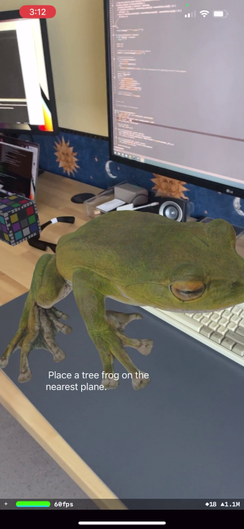
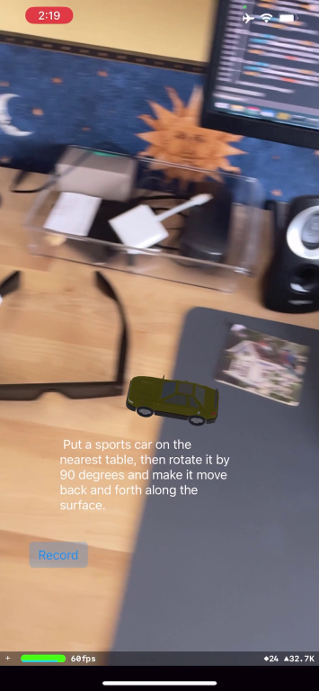
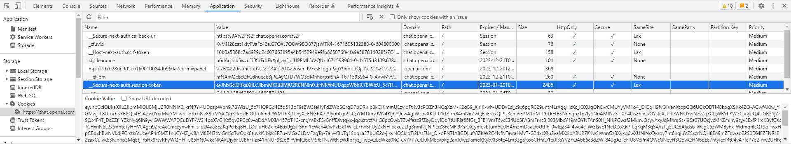

# ChatARKit: Using ChatGPT to Create AR Experiences with Natural Language
*Copyright 2022 Bart Trzynadlowski*

## Demo Video

[Click here for a demo video](https://www.youtube.com/watch?v=sA8hcOUJ6B0).




## Overview

ChatARKit is an experiment to see whether [ChatGPT](https://chat.openai.com/chat) can be harnessed to write code using custom user-defined APIs. You can speak a prompt asking ChatARKit to place objects of a certain type on nearby planes and perform some basic manipulations of their position, scale, and orientation. More interactions could readily be added. Here are some sample prompts to try:

- "Place a cube on the nearest plane."
- "Place a spinning cube on the floor."
- "Place a sports car on the table and rotate it 90 degrees."
- "Place a school bus on the nearest plane and make it drive back and forth along the surface."

Full disclosure: the demo video represents some of the best results I got. Performance is generally worse.  ChatGPT produces highly variable results for identical prompts. It frequently injects JavaScript functions that are not present in my JavaScriptCore execution context and will misinterpret the relationship between the user, `cameraPosition`, and planes. Sometimes it converts object descriptions into code-like identifiers (e.g., "school bus" becomes "schoolBus"), which breaks the Sketchfab querying logic. Much of this is fixable and it's a good idea to examine the generated code, which is printed to the console by both the iOS app and the ChatGPT server. If OpenAI changes the model or takes further action to block bots, this demo could cease to function altogether.

I encourage interested developers to contact me and discuss ways this could be improved and turned into a more robust demo. And if you have any other fun ideas for AI projects, I'm always up to chat :)

ChatARKit consists of an iOS app and a Python server for interacting with ChatGPT. It makes use of the following projects:

- [whisper.cpp](https://github.com/ggerganov/whisper.cpp) by Georgi Gerganov. Fast C++ implementation of OpenAI's Whisper speech-to-text model.
- [GLTFSceneKit](https://github.com/magicien/GLTFSceneKit) by magicien. gLTF loader for SceneKit, used to import 3D assets from [Sketchfab](https://sketchfab.com).
- [Zip](https://github.com/marmelroy/Zip) by Roy Marmelstein. Swift framework for unzipping files, used to unzip files downloaded from Sketchfab.
- [pyChatGPT](https://github.com/terry3041/pyChatGPT) by terry3041. A Python wrapper for accessing ChatGPT. My Python ChatGPT server app depends on this.

## Usage Instructions

### 1. Obtain a Sketchfab API Token

[Sketchfab](https://sketchfab.com) is used to fetch 3D assets (except "cube" which is handled natively). Sign up for a free user account and then under your profile settings, find your API token. Open up `iOS/ChatARKit/ChatARKit/Engine/SketchfabEntity.swift` and overwrite the dummy token in `_jsonPayloadHeader` near the top of the `SketchfabEntity` class.

The profile settings can be found by clicking on your user icon in the upper right. Then, click *Edit Profile*.


The API token is under *Passwords & API*.


### 2. Obtain a ChatGPT Session Token

Log into [ChatGPT](https://chat.openai.com/chat) and find your session token. In Chrome, open up *Developer Tools* and look for `__Secure-next-auth.session-token` under the *Application* tab and *Cookies*, which appears under *Storage*.

  

### 3. Set Up Python Environment

[pyChatGPT](https://github.com/terry3041/pyChatGPT) must be installed. I recommend using [conda](https://conda.io/docs/user-guide/install/) to manage your environment. In the ChatARKit repository directory, create a conda environment, clone pyChatGPT, and install it like so:

```
conda create -n chatarkit python=3.10
conda activate chatarkit
git clone https://github.com/terry3041/pyChatGPT.git
cd pyChatGPT
pip install -U pyChatGPT
```

### 4. Run the ChatGPT Python Relay Server

If using conda, make sure your conda environment is activated, e.g.:

```
conda activate chatarkit
```

Then simply run `chatgpt.py`:

```
python -m chatgpt
```

By default, it will listen on port 6502. It will ask you for the session token obtained in step 2. Paste it and press enter. A Chromium window should appear and automatically log into ChatGPT.

### 5. Download the Whisper Model Weights

Before opening the iOS project, make sure to download the required Whisper model. From the root of the repository directory on MacOS, type:

```
curl -L --output iOS/ChatARKit/ChatARKit/ggml-base.en.bin https://huggingface.co/datasets/ggerganov/whisper.cpp/resolve/main/ggml-base.en.bin
```
 
### 6. Launch ChatARKit on iPhone

Open iOS/ChatARKit/ChatARKit.xcodeproj and deploy ChatARKit to your iPhone. Connect to the ChatGPT Python relay server by using your computer's local IP address. On Windows, this can be found using the `ipconfig` command. On MacOS or Linux, use `ifconfig`.

### 7. Try a Prompt!

Look around to ensure some planes are detected and then press the *Record* button and speak a prompt. For example: "Place a cube on the nearest plane." Press *Stop* when finished to parse the result. You should see ChatGPT producing a response in the Chromium window. This can take a very long time. Be patient. Once ChatGPT is finished, the code is beamed back to your iPhone and should hopefully execute successfully.

## How It Works

The ChatGPT relay server is pretty straightforward: it accepts connections, passes prompts received from them to ChatGPT, and then sends back the responses with prose and code neatly segregated.

The ChatARKit iOS app is more complex. A JavaScript environment is set up allowing scripts that create entities (objects with a visual representation that can be manipulated) to be run. The important source files to understand are:

- `ViewController.swift`: This manages the UI and the connection to the relay server. When connected, a *Record* button appears in the lower left. Pressing this button starts capturing audio from the microphone and pressing stop passes it to Whisper for transcription. Most of this logic is near the very top in `onToggleRecordButtonPressed()`. The text is sent to ChatGPT and the response eventually arrives in `onMessageReceived()`, where the JavaScript code contained inside is passed to the AR engine for execution.
- `Engine.swift`: This is the AR experience engine. It is responsible for 1) running the ARKit session and 2) executing JavaScript code. JavaScriptCore is used to create a JavaScript execution context with a few custom functions and variables defined for scripts to use. The engine also constructs the final prompt sent to ChatGPT in `augmentPrompt()`. Here, the custom JavaScript environment is described in a lengthy preamble, the user prompt is spliced in, and some additional constraints are added for good measure.
- `Entity.swift`: `Engine.createEntity()` creates entities that are exposed to the JavaScript run-time. They contain only a few properties (`position`, `scale`, and `euler`, each a 3-element array of floats). I couldn't quite figure out how to expose these properties correctly. Using the `JSExport` protocol produces fields that are read-only, so I employ a gross workaround.

The following methods and properties are exported to JavaScript:

- `print()`: Prints to the console.
- `getPlanes()`: Returns an array of all planes that have been found by ARKit.
- `getNearestPlane()`: Returns the nearest plane to the user.
- `getGroundPlane()`: Returns the lowest plane.
- `createEntity()`: Takes a string describing the entity to create and instantiates it. If the description is "cube", it will create a simple cube. Otherwise, the description is used to search Sketchfab for a model to import.
- `distance()`: Computes the distance between two 3D vectors represented as 3-element arrays. ChatGPT sometimes insists on using functions it thinks exists and `distance()` is a common one. Instead of trying to fight it, I gave in and implemented it.
- `cameraPosition`: The current AR camera position as a 3-element array.

It is interesting to note that ChatGPT is usually smart enough to implement the functionality of `getNearestPlane()` and sometimes even `getGroundPlane()` on its own. However, it occasionally gets spectacularly confused and will do something nonsensical. Luckily, it will usually end up using functions that are described to it in the prompt. ChatGPT also has a nasty habit of defining functions after it has used them, which produces code that fails to run.

Common sources of problems:
- ChatGPT generates bad code that fails to run. Examine the output carefully when this happens.
- No suitable models are found by Sketchfab, the models fail to download, or an import error is experienced.
